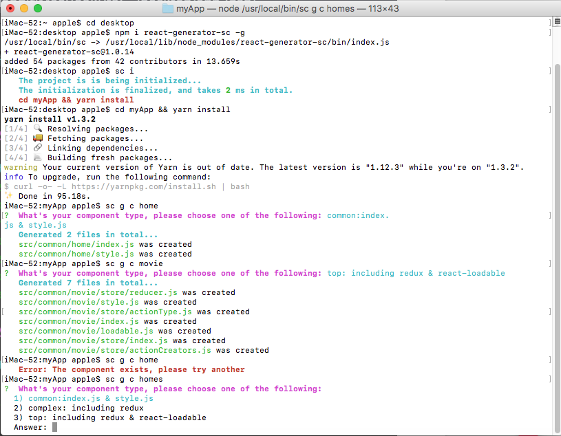
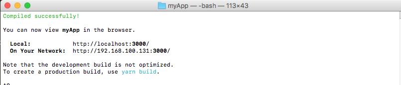
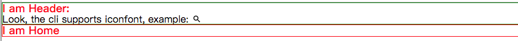

# react-generator-sc

## introduction
1. **`react-generator-sc`**: It's a cli for `react`, similar like [vue-cli](https://github.com/vuejs/vue-cli) and more like [Angular cli](https://github.com/ng-packagr/ng-packagr), since it can not only build project itselft but also build components. So we can call it as `a full-stack cli`.
2. **`templates`**: The templates are base on [create-react-app](https://github.com/facebook/create-react-app), if you hava any good idea about templates, feel free to reach out to me.

## how to use?

### 1. installation
```
npm i react-generator-sc -g

```
### 2. init project
```
sc i [yourProjectName]
# if [yourProjectName] is null, and it will create a project called myApp by default.
```
## other commands
```
sc g c [yourComponentName]
sc g p [yourPageName]
```
## Test
```
npm run start
```
  <br/>
  <br/>
  <br/>

## contact me
If you have any issue in using this cli, please write to me, will reply to you when available. My email is mbp98k@gmail.com

## some issue you may meet in devoloping cli
1. fs.copy(), copy and replace in batch
2. define projectFolder and apply to your project
3. fetch arguments in terminal
4. the way to change .npmigore to .gitignore

## updates
- add `__TEST__` folder in src and `homepage` property in package.json  12/26/2018

License
MIT © [Scott Xiong](https://github.com/scott-x)
